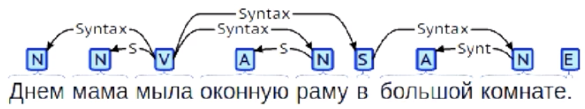
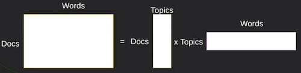

# Introduction
## Termins
1. **Язык** - множество допустимых цепочек символов из некоторого алфавита.
    * Цепочки строятся по некоторым правилам.
    * Текст - одна такая цепочка.
    * Алфавит - множество символов, из которых строятся тексты языка.
    * Каждая цепочка может нести какую то информацию.
---
2.  1. **Сырой текст**:
    >"Мама мыла раму. Потом мы пошли гулять."

    2. **Токенизированный текст**(Графематический анализ), это составление списков по предложениям 
    и по предложению составление списков по словам находящимся в нём. 
    >[ ["Мама","мыла","раму","."],["Потом","мы","пошли","гулять."]]

    3. **Тест с морфологическими тегами**:
    >[ [Token("Мама",init="мама",pos="сущ"), Token("мыла",init="мыть",pos="глаг"),Token("раму",init="рама",pos="сущ"), ... ], ... ]
---
3. **Глагол** - является главным словом в предложении.
---
4. **Синтаксический анализ**(Дерево зависимостей), добавим **synt_parent** для взаимосвязи "кому подчиняется" данное слово.
    В данном примере все существительные подчиняются глаголу, а прилогательное своему существительному.
    >  "Мама мыла оконную раму тряпкой." 
          
    >    [ [ \
            Token("Мама",init="мама",pos="сущ", **synt_parent=1**), \
            Token("мыла",init="мыть",pos="глаг", **synt_parent=None**), \
            Token("оконную",init="окно",pos="прил", **synt_parent=3**), \
            Token("раму",init="рама",pos="сущ", **synt_parent=1**), \
            Token("тряпкой",init="тряпка",pos="сущ", **synt_parent=1**) \
        ], ... ]
---
5. **Дискурсивный анализ** - тоже самое, что и *cинтаксический анализ*, только для докуметов в целом.
---
6. **Семантический анализ** (?)
---
## Features

7. **Флективность** - возможность менять форму слова, в зависимости от ситуации. 
    * Склонение по падежам:

        > a cat, to the cat, many cats

        > кошка, кошке, кошки
    * Слово образование с помощью приставок:
        > брать - to take

        > прибрать - to tidy up

        > перебрать - to sort out
---
8. **Омонимия** - неоднозначиность в зависимоти от контекста (присутствует практически во всех языках).
    * Смысловая:
        > Morfphology is a **well** studied area. \
        > **Well**, I will do that.\
        > Put the flour on a flat surface and make a **well** to hold the eggs.

        > **Прибрать** комнату (сделать уборку) \
        > **Прибрать** к рукам (присвоить забрать) 
        
        > **Перебрать** мотор (разобрать и собрать) \
        > **Перебрать** спиртного (выпить слишком много)
    * Частеричная - не однозначность в определении части речи (глагол, существительное или прилогательное).
        > Мама **мыла** раму.

        > В ванной не было **мыла**.
---
9. **Естественный язык**
    * Никем специально не составлялся, а появился в результате потребности людей в коммуникации.
    * Правила строго не регламентированы (Меняются в зависимости от региона и от времени)
    * Допустимы отклонения от правил(До разумного придела)
---
10. **Формальные языки**
    * Правила строго регламентированы
    * Процесс разбора и поиска ошибок детерминирован(определён)
    * Наличие эффективных алгоритмов для обработки языка
    >1. Языки программирования:
            a. Python\
            b. C++\
            c. Java\
                и т.д.
    >2. Математические формулы
---
11. **Лингвистическая топология** - наука отвечающая за: 
    * Группировку и классификацию языков.
    * Отличия в образовании и изменении слов в зависимости от ситуации
    * Отличия в связывании слов друг с другом
    * Отличия в способах передачи смысла
    
    _| Английский | Русский
    --- | --- | ---
    Флективность(словоизложение)| слабая | сильная
    Смысловая омонимия | высокая | высокая
    Частеричная омонимия | сильная | умеренная
    Порядок слов | фиксированный | свободный
---
12. **Стеминг(Stemming)** - получение начальной формы слова, с помощью отбрасывания окончания и приставок.
    > cats -> cat

    но:
    >  ~~кошки -> кошк~~
---
13. **Лемматизация** - использование знаний, о точной части речи слова.
    > cats -> cat

    > кошки -> кошка
---
14. **Word sense disambiguation** - выбор смысла слова. \
    Задача, которая нужна для разрешения проблем связанных с омонимией.
---
15. **Вариативность порядка слов** - она различна в разных языках:
    >>Дом, который построил Джек, я разрушил.\
    >>Дом, который построил Джек, разрушил я.\
    >>Я разрушил дом, который построил Джек.\
    >>Джек построил дом, который я разрушил.\
    >
    >> I destroyed the house that Jack built.
---
16. **Sentiment analysis** - анализ тональности текста:

    Текст|Характеристика|Оценка
    ---|---|---
    Экран, в отличие от ёмкости батареи, отличный.|	экран|отличный
    Экран, в отличие от ёмкости батареи, отличный.|	ёмкость батареи|	низкая
    Экран отличный, но плохая батарея|	экран|	отличный
    Экран отличный, но плохая батарея|	батарея|	плохая
---
17. **Анафорические связи в тексте** — отношения между частями текста (между словами, словосочетаниями, высказываниями),  
    при которых в смысл одного слова (словосочетания, высказывания) входит отсылка к другому слову (словосочетанию, высказыванию). 
    > **Машинист** управлял огромным поездом. Сегодня **он** был слишком уставший для этой работы.
---
18. **Извлечение структуры текста** -  является основой для решения последующих заданий. \
    Структура решения задачи: 

    1. Подготовка 
        1. Графематический анализ
    2. Анализ отдельных предложений 
        1. Морфологический анализ
        2. POS-теггинг
        3. Извечение именнованных сущностей
        4. Синтаксический анализ
        5. Семантический анализ
        6. Извлечение отношений между сущностями внутри предложения
    3. Анализ целых текстов
        1. Разрешение анафорических связей
        2. Дискурсивный анализ
---
19. **Shift-reduce parser** - метод предназначенный для наложения грамматики на текстовые данные \
    Данный метод применяется, к примеру, для определения последовательности вычисления математических выражений
    >a+b*c
    Составляется вручную или обучающими решающими правилами, в том числе нейросетевыми (Malt parser, SyntaxNet)
---
20. **Лексема** - слово как абстрактная единица морфологического анализа.
    >словарь, словарём, словарю
---
21. **Механизмы реализации**
    1. Графематический анализ
        * Regular expression
        * Вероятностные модели (Hidden Markov Model, Conditional Random Fields) для решиния неоднозначности.
            >Я прочитал роман  М.А.Булгакова. Великий писатель.

            В данном примере, присутвует неодназначность окончания первого предложения.
    2. Морфологический анализ - в качестве единицы обработки, является - токен.
        * Словари
        * Системы правил, регулярные выражения
    3. Разрешение частеричной омонимии - выбор между предложенными вариантами, морфологического анализа \
        (Происходит в рамках одного предложения)
        * Системы правил
        * Вероятностные модели последовательностей (Hidden Markov Model, Conditional Random Fields)
        * Рекуррентные нейросети
    4. Извлечение именнованных сущностей. Единицей анализа, будет предложение. \
        Механизмы:
        * Словари уникальных имён (Samsung, Сбербанк)
        * Системы правил, регулярные выражения(к примеру для email)
        * Вероятностные модели последовательностей (Conditional Random Fields,Hidden Markov Model)
        * Нейронные сети, позволяют объединить эти подходы

        Результат:
        * Организация
        * Имя
        * географическое наименование
        * ...
    5. Синтаксический анализ
        
        * Shift-reduce parser
    6. Семантический анализ. Единица измерения будет клауза(простое предложение)
        * Определяется предикат(главное слово), он задаёт структуру ситуации.
        * Ситуация состоит из слотов (валентностей, ролей) и из заполняющих эти слоты аргументов.
    7. Извлечение анафорических связей, отношений между сущностями.
        * Попарные классификаторы, основанные на системах правил, классическом машинном обучении или на нейросетях.
    8. Дискурсифный анализ
        * Shift-reduce parser
    9. Задача генерации текста
        * input:
            >фрейм predicate=подписать, subject=гендиректор, object=соглашение 

            или
            >вектор признаков
        * output:
            >text в виде цепочки лексем или символов
        *  Механизмы:
            - Генерация через поиск (retrieval based text generation)
            - Генерация по шаблону (template based text generation)
            - Генерация с помощью нейросетей (Область плохо изучена на данный момент)
---
## Get features
22. **Двоичный вектор** - Тоже самое что и  *one-hot encoding*
    
    Рассмотрим пример:
    >"Днём мама мыла раму. Вечером мы пошли гулять."

    Имея словарь слов, мы можем сделать двоичный вектор, указывающий наличие слов в блоке.
    и  |мы |мама|велосипед|...|рама
    ---|---|--- |---      |---|---
     0 | 1 |  1 |     0   |...| 1 

    Примущества:
    * Простота
    * Подходит, когда тексты сильно отличаются по длине
    * Если размерность вектора очень большая, простые линейные модели хорошо работают
    
    Недостатки:
    * Не передаёт количество, передаваемых слов
    * Значимость специальных слов такая же, как и частотных общеупотребимых.
    * Чувствителен к шуму (к примеру ошибки в написании слова)
    * Близкие по смыслу слова ("кружка" и "чашка") кодируются не зависящими друг от друга \
        элементами вектора. Это значит, что может страдать обобщающая способность.

---
23. **Term Frequency - Inverse Document Frequency(TF-IDF)**
    и  |мы |мама|велосипед|...|рама
    ---|---|--- |---      |---|---
     0 | 0.01 |  0.1 |     0   |...| 2

    Примущества:
    * Простота
    * Очень хорошо описывает особенности тематики документов
    * Если размерность вектора очень большая, простые линейные модели хорошо работают
    * Легко заложить в модель знания о предметной области(экспертное мнение)

    Недостатки:
    * Чувствителен к шуму
    * Близкие по смыслу слова ("кружка" и "чашка") кодируются не зависящими друг от друга \
        элементами вектора. Это значит, что может страдать обобщающая способность.
    * Если размерность вектора очень большая, на небольшой обучающей выборке высока вероятность переобучения.
---
24. **N-грамма** - объект, состоящий из нескольких подряд идущих базовых элементов.\
    >"Днём мама мыла раму"

    Они бывают **символьными**:

        "днё","нём","ём ","м м"," ма","мам", ...

    Или **словными**:

        "день мама","мама мыть","мыть рама"  

    Применяется: 
    * вместе с TD-IDF
    * в дисрибутивной семантике, FastText word embeddings
    
    Преимущества: 
    * простота
    * работа с флективными языками без полноценной морфологии и POS-теггинга
    * более специфические признаки, чем отдельные слова

    Недостатки: 
    * высокая размерность и разряженность
    * Близкие по смыслу слова ("кружка" и "чашка") кодируются не зависящими друг от друга \
        элементами вектора. Это значит, что может страдать обобщающая способность.
    * Если размерность вектора очень большая, на небольшой обучающей выборке высока вероятность переобучения.

25. **Сжатие вектора** \
    

26. **Виды прикладых задач**
    * Классификация
        - Тематическая классификация длинных текстов
        - Классификация коротких текстов (по тональности, интенции)
    * Поиск
        - Поиск по запросу
        - Поиск текста по изображению и изображений по текстам
        - Поиск похожих текстов
        - Вопросно-ответный поиск
    * Извлечение структурированной информации
    * Диалоговые системы
    * Машинный перевод
    * Эксплоративный анализ
---
27. **Тематическая классификация** , является классической задачей NLP. 
    
    1. 
        Input:
        * Коллекция текстов с проставленными метками.
        * Каждый текст состоит хотя бы из нескольких предложений. 
        * Метки определяются составом текста в целом, а не отдельными фразами и их структурой.
        
        Необходимо получить алгоритм, предсказывающий метки.

        Механизмы:
        * Линейные модели классификации, векторное представление, TF-IDF
    2.
        Input:
        * Каждый текст - одно или два предложения.
        * Для текстов проставлены метки.
        * Метки определяются не сколько составом текста в целом, сколько структурой фраз.

        >"Готовимся к плохому, в итоге получилось хорошо."

        Необходимо получить алгоритм, предсказывающий метки.

        Механизмы:
        * Нейросети
        * Ядерные методы
        * Системы правил (лексико-синтаксические шаблоны)

    
